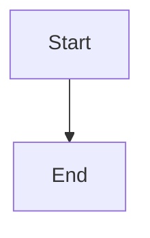

# Claude Code Configuration Package
## Custom Save Locations, Naming Conventions & WCAG 2.2 AA Compliance

This configuration package ensures Claude Code:
1. ✅ Saves plans to `./docs/plans/` with format `plan-YYYY-MM-DD-description.md`
2. ✅ Follows consistent naming conventions across all file types
3. ✅ **Creates WCAG 2.2 AA compliant web code (MANDATORY)**
4. ✅ Provides custom commands for common tasks
5. ✅ Enforces security best practices

---

## 📦 What's Included

| File | Purpose |
|------|---------|
| `CLAUDE.md` | Global instructions with naming rules, **WCAG 2.2 AA requirements** & **Mermaid.js rules** |
| `settings.json` | Model selection and permissions |
| `new-plan.md` | Custom `/new-plan` command |
| `accessible-component.md` | Custom `/accessible-component` command for web development |
| `create-mermaid.md` | Custom `/create-mermaid` command for diagrams |
| `WCAG-quick-reference.md` | Quick reference guide for web accessibility |
| `mermaid-quick-reference.md` | Quick reference guide for GitHub-compatible Mermaid diagrams |
| `install.sh` | Automatic installation script |
| `claude-code-setup-guide.md` | Detailed documentation |

---

## 🚀 Quick Install (Recommended)

```bash
# Make installer executable
chmod +x install.sh

# Run the installer
./install.sh
```

That's it! The installer will:
- Create `~/.claude/` directory structure
- Backup existing configurations
- Install all files
- Set proper permissions

---

## 📋 Manual Install

If you prefer to install manually:

```bash
# Create directories
mkdir -p ~/.claude/commands

# Copy configuration files
cp settings.json ~/.claude/settings.json
cp CLAUDE.md ~/.claude/CLAUDE.md
cp new-plan.md ~/.claude/commands/new-plan.md
cp accessible-component.md ~/.claude/commands/accessible-component.md
cp WCAG-quick-reference.md ~/.claude/WCAG-quick-reference.md

# Set permissions
chmod 644 ~/.claude/*.json
chmod 644 ~/.claude/*.md
chmod 644 ~/.claude/commands/*.md
```

---

## ♿ Web Accessibility - CRITICAL INFORMATION

### **ALL web code MUST be WCAG 2.2 AA compliant**

This is NON-NEGOTIABLE. Every HTML, CSS, JavaScript, React, or web component you create must meet accessibility standards.

#### The Big Rules (Learn These First):

1. **Alt text for images** - Every image needs descriptive alt text or `alt=""`
2. **Color contrast** - Text must meet 4.5:1 ratio (normal) or 3:1 (large)
3. **Keyboard access** - Everything works without a mouse
4. **Focus indicators** - Always visible (never `outline: none` without replacement)
5. **Form labels** - Every input has a proper `<label>`
6. **Semantic HTML** - Use `<button>` not `<div onclick>`
7. **Heading hierarchy** - h1→h2→h3 (no skipping)
8. **Link text** - Descriptive ("Read our report" not "Click here")
9. **Error messages** - Clear and helpful
10. **Touch targets** - Minimum 24×24 CSS pixels

#### Before You Commit ANY Web Code:

✅ **Run these tests (3-5 minutes):**
1. Tab through with keyboard only (no mouse)
2. Run axe DevTools browser extension
3. Check color contrast with WebAIM checker
4. Test with screen reader (NVDA/VoiceOver)
5. Verify at 200% zoom

#### Quick Reference

For detailed accessibility guidelines, see:
- `~/.claude/CLAUDE.md` - Full requirements built into every session
- `~/.claude/WCAG-quick-reference.md` - Quick reference guide
- Use `/accessible-component` command for pre-built accessible patterns

---

## 📊 Mermaid Diagrams - GitHub Compatibility (CRITICAL)

### **ALL Mermaid diagrams MUST render on GitHub**

This is NON-NEGOTIABLE. Every Mermaid diagram you create must use the correct format to display on GitHub.

#### The ONE Correct Format:

```markdown

```

#### Critical Rules:

1. **ALWAYS use \`\`\`mermaid fence** (three backticks + word "mermaid")
2. **NEVER use HTML divs** - `<div class="mermaid">` won't render
3. **Test on mermaid.live** before committing - https://mermaid.live/
4. **Use proper syntax** - arrows are `-->` not `->`

#### Before You Commit ANY Diagram:

✅ **Quick checks (1 minute):**
1. Using \`\`\`mermaid fence (not \`\`\`mermaidjs or \`\`\`diagram)
2. Tested on https://mermaid.live/
3. No syntax errors
4. Labels are descriptive

#### Quick Reference

For detailed Mermaid guidelines, see:
- `~/.claude/CLAUDE.md` - Full requirements built into every session
- `~/.claude/mermaid-quick-reference.md` - Quick reference guide with examples
- Use `/create-mermaid` command for pre-built diagram templates

#### Supported Diagram Types:

- ✅ Flowcharts / Process flows
- ✅ Sequence diagrams
- ✅ Class diagrams
- ✅ State diagrams
- ✅ Entity Relationship Diagrams (ERD)
- ✅ Gantt charts
- ✅ Pie charts
- ✅ Git graphs

---

## 🎯 What This Configures

### File Organization

**Plans & Documentation:**
```
project-root/
├── docs/
│   ├── plans/              # All planning documents
│   │   ├── features/       # Feature plans
│   │   ├── bugfixes/       # Bug fix plans
│   │   └── refactor/       # Refactoring plans
│   ├── architecture/       # Architecture decisions
│   └── api/               # API documentation
├── src/                   # Source code
├── tests/                 # Test files
└── tmp/                   # Temporary files
```

### Naming Conventions

| File Type | Format | Example |
|-----------|--------|---------|
| Plans | `plan-YYYY-MM-DD-description.md` | `plan-2025-11-30-user-auth.md` |
| Docs | `kebab-case.md` | `database-schema.md` |
| Python | `snake_case.py` | `user_service.py` |
| JavaScript | `camelCase.js` | `userService.js` |
| React | `PascalCase.jsx` | `UserProfile.jsx` |

### Security

Protected files (cannot write):
- `.env*` files
- `*.secret.*` files
- `credentials.*` files

Protected commands (cannot run):
- `rm -rf *`
- `sudo rm *`

---

## 🛠️ Usage Examples

### Start Claude Code

```bash
# Start in current directory
claude

# Start with specific workspace
claude -w /path/to/project

# Add additional directory
claude --add-dir /path/to/libraries
```

### Create a New Plan

```bash
# In Claude Code session
/new-plan
```

This will:
1. Ask for plan description
2. Get today's date automatically
3. Create `docs/plans/plan-YYYY-MM-DD-description.md`
4. Use the standard plan template
5. Ask if you want to fill it in now

### Create Accessible Web Component

```bash
# In Claude Code session
/accessible-component
```

This will:
1. Ask what component you need (button, form, modal, etc.)
2. Create WCAG 2.2 AA compliant code
3. Verify color contrast ratios
4. Include proper ARIA attributes
5. Provide keyboard support
6. Include testing checklist

### Create GitHub-Compatible Mermaid Diagram

```bash
# In Claude Code session
/create-mermaid
```

This will:
1. Ask what type of diagram you need
2. Create proper \`\`\`mermaid fence format
3. Test syntax on mermaid.live
4. Ensure GitHub compatibility
5. Provide complete markdown code

### Check Configuration

```bash
# View current settings
/status

# Open configuration
/config
```

---

## 📖 References

### Accessibility Resources

**Built-In References:**
- `~/.claude/CLAUDE.md` - Complete WCAG 2.2 AA requirements
- `~/.claude/WCAG-quick-reference.md` - Quick reference guide

**External Tools:**
- **axe DevTools** - Browser extension for automated testing
- **WAVE** - Visual accessibility evaluation tool  
- **WebAIM Contrast Checker** - https://webaim.org/resources/contrastchecker/
- **W3C Validator** - https://validator.w3.org/

**Screen Readers:**
- **NVDA** (Windows, Free) - https://www.nvaccess.org/
- **JAWS** (Windows, Paid) - Industry standard
- **VoiceOver** (Mac/iOS, Built-in) - Cmd+F5 to toggle
- **TalkBack** (Android, Built-in) - In accessibility settings

### Mermaid Diagram Resources

**Built-In References:**
- `~/.claude/CLAUDE.md` - Complete Mermaid requirements
- `~/.claude/mermaid-quick-reference.md` - Quick reference with examples

**External Tools:**
- **Mermaid Live Editor** - https://mermaid.live/ (TEST ALL DIAGRAMS HERE)
- **Official Mermaid Docs** - https://mermaid.js.org/
- **GitHub Markdown Guide** - https://docs.github.com/en/get-started/writing-on-github

---

## 🎓 Learning Path

### Day 1: Basics
1. Read `WCAG-quick-reference.md`
2. Learn the 10 essential rules
3. Practice with `/accessible-component`

### Week 1: Practice
1. Create 5 different accessible components
2. Test each with keyboard only
3. Run axe DevTools on everything

### Month 1: Mastery
1. Test with real screen readers
2. Learn advanced ARIA patterns
3. Contribute accessible components

---

## ⚙️ Customization

### Add Custom Commands

Create a new command file:

```bash
nano ~/.claude/commands/my-command.md
```

Add your instructions in markdown format.

Use in Claude Code:
```bash
/my-command
```

### Modify Naming Rules

Edit the global instructions:

```bash
nano ~/.claude/CLAUDE.md
```

Change the naming conventions in the "Naming Convention Rules" section.

### Adjust Permissions

Edit settings:

```bash
nano ~/.claude/settings.json
```

Modify the `permissions.allowedTools` or `permissions.deny` arrays.

---

## 🔍 Verification

### Verify Installation

```bash
# Check files exist
ls -la ~/.claude/
ls -la ~/.claude/commands/

# Check file contents
cat ~/.claude/settings.json
head -20 ~/.claude/CLAUDE.md
```

### Test Configuration

```bash
# Start Claude Code
claude

# Try commands
/status
/new-plan
/accessible-component

# Check WCAG enforcement
# Try creating any web component - it should automatically be accessible
```

---

## 🐛 Troubleshooting

### Configuration Not Loading

```bash
# Verify file locations
ls ~/.claude/CLAUDE.md
ls ~/.claude/settings.json

# Check JSON validity
python -m json.tool ~/.claude/settings.json

# Restart Claude Code completely
# Exit current session, close terminal, open new terminal
claude
```

### Commands Not Working

```bash
# Check command files exist
ls ~/.claude/commands/

# Verify markdown files are readable
cat ~/.claude/commands/new-plan.md

# Try using /help to see available commands
```

### Accessibility Violations

If Claude Code creates non-compliant web code:

1. **Remind it**: "This must be WCAG 2.2 AA compliant"
2. **Use the command**: `/accessible-component`
3. **Reference the guide**: "Check WCAG-quick-reference.md"
4. **Be specific**: "This needs proper alt text" or "Color contrast must be 4.5:1"

---

## 📚 Additional Documentation

- **Full Setup Guide**: `claude-code-setup-guide.md`
- **WCAG Quick Reference**: `WCAG-quick-reference.md`
- **Official Claude Code Docs**: https://code.claude.com/docs

---

## 🤝 Support

### Getting Help

1. **Check CLAUDE.md** - All rules are documented there
2. **Use `/status`** - Verify current configuration
3. **Read WCAG reference** - For accessibility questions
4. **Official docs** - https://code.claude.com/docs

### Reporting Issues

If Claude Code isn't following the accessibility rules:
1. Check that CLAUDE.md is properly installed
2. Verify you're in a web development context
3. Explicitly mention "WCAG 2.2 AA compliance" in your request
4. Use the `/accessible-component` command for guaranteed compliance

---

## 🎯 Success Criteria

You'll know everything is working when:

✅ Claude Code automatically creates plans in `./docs/plans/`
✅ All plans use the `plan-YYYY-MM-DD-description.md` format
✅ Web code is WCAG 2.2 AA compliant by default
✅ Color contrast ratios are verified automatically
✅ Keyboard accessibility is built into all components
✅ Form inputs always have labels
✅ Images always have alt text
✅ Focus indicators are always visible
✅ Mermaid diagrams use \`\`\`mermaid fence format
✅ Mermaid diagrams render correctly on GitHub

---

## 📄 License & Credits

This configuration package is provided as-is for use with Claude Code.

**Accessibility Standards**: WCAG 2.2 (W3C Web Content Accessibility Guidelines)
**Tools Recommended**: axe DevTools, WAVE, WebAIM, NVDA

---

## 🚀 Quick Start Checklist

- [ ] Run `./install.sh` or manually copy files
- [ ] Verify installation: `ls ~/.claude/`
- [ ] Start Claude Code: `claude`
- [ ] Test `/new-plan` command
- [ ] Test `/accessible-component` command
- [ ] Test `/create-mermaid` command
- [ ] Read `WCAG-quick-reference.md`
- [ ] Read `mermaid-quick-reference.md`
- [ ] Create your first accessible component
- [ ] Test with keyboard only
- [ ] Run axe DevTools
- [ ] Create a test Mermaid diagram
- [ ] Verify diagram on https://mermaid.live/
- [ ] You're ready to code! 🎉

---

**Remember: Accessibility is not optional. It's built into every line of web code you write.**

**Remember: Mermaid diagrams must use \`\`\`mermaid fence to render on GitHub.**

Happy coding! ♿📊✨
