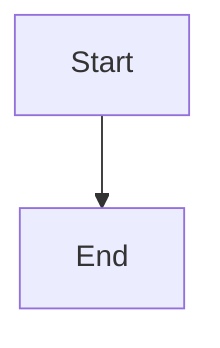

# Configuration Package - Complete Summary

## ✅ What's Been Created

Your Claude Code configuration package now includes **THREE critical enforcement areas**:

1. **Custom save locations & naming conventions**
2. **WCAG 2.2 AA web accessibility compliance** 
3. **GitHub-compatible Mermaid diagrams** ✨ NEW

---

## 📦 Complete File List (11 files)

| File | Size | Purpose |
|------|------|---------|
| `CLAUDE.md` | 23KB | **Main configuration** - All rules, WCAG requirements, Mermaid requirements |
| `README.md` | 13KB | Complete documentation & setup guide |
| `QUICKSTART.md` | 6.3KB | Get started in 30 seconds |
| `WCAG-quick-reference.md` | 14KB | Accessibility quick reference with examples |
| `mermaid-quick-reference.md` | 11KB | **NEW** - Mermaid diagram guide with examples |
| `settings.json` | 308B | Model & permissions configuration |
| `new-plan.md` | 1.8KB | Custom `/new-plan` command |
| `accessible-component.md` | 4.6KB | Custom `/accessible-component` command |
| `create-mermaid.md` | 6.2KB | **NEW** - Custom `/create-mermaid` command |
| `install.sh` | 4.2KB | One-click installation script |
| `claude-code-setup-guide.md` | 7.7KB | Detailed setup documentation |

**Total package size: ~93KB**

---

## 🆕 New Mermaid Features

### What Was Added:

1. **Comprehensive Mermaid rules in CLAUDE.md**
   - MANDATORY \`\`\`mermaid fence format
   - GitHub rendering requirements
   - Syntax guidelines
   - Testing requirements

2. **New quick reference: mermaid-quick-reference.md**
   - All diagram types with examples
   - Common mistakes to avoid
   - Testing checklist
   - Complete templates

3. **New command: /create-mermaid**
   - Generates GitHub-compatible diagrams
   - Tests syntax automatically
   - Provides complete markdown code

### The ONE Critical Rule:

```markdown
ALL Mermaid diagrams MUST use this format:


```

**Nothing else works on GitHub.**

---

## 🎯 Three Enforcement Areas

### 1️⃣ File Organization & Naming ✅
- Plans → `./docs/plans/plan-YYYY-MM-DD-description.md`
- Automatic directory creation
- Consistent naming across all file types
- Security protections for sensitive files

### 2️⃣ WCAG 2.2 AA Compliance ✅
**MANDATORY for ALL web code:**
- Alt text for images
- 4.5:1 color contrast minimum
- Keyboard accessibility
- Screen reader compatibility
- Form labels
- Focus indicators
- ARIA attributes
- Semantic HTML

### 3️⃣ Mermaid GitHub Compatibility ✅ NEW
**MANDATORY for ALL diagrams:**
- \`\`\`mermaid fence format only
- Test on https://mermaid.live/
- Proper syntax validation
- Clear, descriptive labels
- GitHub rendering verified

---

## 🚀 Installation

**One command:**
```bash
chmod +x install.sh && ./install.sh
```

**What it installs:**
```
~/.claude/
├── settings.json
├── CLAUDE.md (with all three enforcement areas)
├── WCAG-quick-reference.md
├── mermaid-quick-reference.md (NEW)
└── commands/
    ├── new-plan.md
    ├── accessible-component.md
    └── create-mermaid.md (NEW)
```

---

## 💻 New Commands Available

```bash
# Create properly named plan
/new-plan

# Create WCAG 2.2 AA compliant web component
/accessible-component

# Create GitHub-compatible Mermaid diagram (NEW)
/create-mermaid

# Check configuration
/status
```

---

## 📋 Quick Testing Checklist

### For Web Components:
- [ ] Tab through with keyboard only
- [ ] Run axe DevTools
- [ ] Check color contrast (4.5:1 minimum)
- [ ] Test with screen reader

### For Mermaid Diagrams (NEW):
- [ ] Uses \`\`\`mermaid fence format
- [ ] Tested on https://mermaid.live/
- [ ] No syntax errors
- [ ] Labels are descriptive

### For Plans:
- [ ] Saved to `./docs/plans/`
- [ ] Named `plan-YYYY-MM-DD-description.md`
- [ ] Uses standard template

---

## 🎓 Learning Path

### Week 1: Basics
1. **Day 1:** Install configuration, read QUICKSTART.md
2. **Day 2:** Read WCAG-quick-reference.md, create first accessible component
3. **Day 3:** Read mermaid-quick-reference.md, create first diagram (NEW)
4. **Day 4:** Create a plan with `/new-plan`
5. **Day 5:** Practice all three commands

### Week 2: Practice
1. Create 5 accessible web components
2. Create 5 different Mermaid diagram types (NEW)
3. Test everything with keyboard + axe DevTools
4. Document your processes

### Month 1: Mastery
1. Build a complete accessible web page
2. Create architecture diagrams with Mermaid (NEW)
3. Test with real screen readers
4. Share knowledge with team

---

## 🔍 Verification

### Check Installation:
```bash
# Verify files
ls -la ~/.claude/
ls -la ~/.claude/commands/

# Check main config
head -50 ~/.claude/CLAUDE.md

# Start Claude Code
claude

# Test commands
/status
/new-plan
/accessible-component
/create-mermaid
```

### Verify Each Feature Works:

**1. Plans:**
```bash
/new-plan
# Should create: docs/plans/plan-2025-11-30-[description].md
```

**2. Accessibility:**
```bash
/accessible-component
# Should create WCAG 2.2 AA compliant code
# Test with keyboard and axe DevTools
```

**3. Mermaid (NEW):**
```bash
/create-mermaid
# Should create ```mermaid fence format
# Test on https://mermaid.live/
```

---

## 📊 Before/After Comparison

### BEFORE this configuration:
❌ Plans saved anywhere
❌ Inconsistent naming
❌ Web accessibility optional
❌ Mermaid diagrams might not render on GitHub
❌ Manual testing required

### AFTER this configuration:
✅ Plans auto-saved to `./docs/plans/`
✅ Consistent naming: `plan-YYYY-MM-DD-description.md`
✅ WCAG 2.2 AA compliance **MANDATORY**
✅ Mermaid diagrams **ALWAYS** GitHub-compatible (NEW)
✅ Testing checklists built-in
✅ Custom commands for common tasks

---

## 🆘 Troubleshooting

### Mermaid Not Rendering on GitHub? (NEW)
1. Check fence format: Must be \`\`\`mermaid (not \`\`\`mermaidjs)
2. Test on https://mermaid.live/ - does it work there?
3. Check syntax: arrows are `-->` not `->`
4. Verify closing fence: \`\`\` on its own line
5. Use `/create-mermaid` command for guaranteed format

### Web Components Not Accessible?
1. Use `/accessible-component` command
2. Run axe DevTools - fix all issues
3. Test with keyboard only
4. Check color contrast ratios

### Plans Going to Wrong Location?
1. Verify CLAUDE.md installed: `cat ~/.claude/CLAUDE.md | grep "Save Location"`
2. Restart Claude Code completely
3. Use `/new-plan` command

---

## 🎯 Success Metrics

You'll know everything is working perfectly when:

✅ **Plans:**
- Created in `./docs/plans/`
- Named `plan-YYYY-MM-DD-description.md`
- Use standard template

✅ **Web Accessibility:**
- All images have alt text
- Colors meet 4.5:1 contrast
- Everything works with keyboard
- axe DevTools shows 0 errors
- Screen readers work correctly

✅ **Mermaid Diagrams (NEW):**
- Use \`\`\`mermaid fence format
- Render on https://mermaid.live/
- Display correctly on GitHub
- Have clear, descriptive labels

---

## 📚 Documentation Hierarchy

1. **Start here:** `QUICKSTART.md` (30 seconds)
2. **Full overview:** `README.md` (10 minutes)
3. **Before web dev:** `WCAG-quick-reference.md` (15 minutes)
4. **Before diagrams:** `mermaid-quick-reference.md` (10 minutes) (NEW)
5. **Deep dive:** `CLAUDE.md` (see all rules)
6. **Detailed setup:** `claude-code-setup-guide.md`

---

## 🎉 You're All Set!

Your Claude Code configuration now enforces:

1. ✅ **Organized file structure** with consistent naming
2. ✅ **Web accessibility** (WCAG 2.2 AA) - no exceptions
3. ✅ **GitHub-compatible diagrams** - renders every time (NEW)

Every time Claude Code starts, it will:
- Know where to save plans
- Know how to name files
- Create accessible web code by default
- Create GitHub-compatible Mermaid diagrams by default (NEW)
- Protect sensitive files
- Provide testing checklists

---

## 🔗 Quick Reference URLs

**Tools to bookmark:**
- Contrast Checker: https://webaim.org/resources/contrastchecker/
- Mermaid Live: https://mermaid.live/ (NEW)
- W3C Validator: https://validator.w3.org/
- axe DevTools: Install browser extension

**Keyboard shortcuts:**
- NVDA (screen reader): Ctrl+Alt+N
- VoiceOver (Mac): Cmd+F5

---

## 💡 Pro Tips

1. Keep mermaid.live open in a browser tab (NEW)
2. Install axe DevTools browser extension
3. Test with keyboard before screen reader
4. Use `/create-mermaid` for all diagrams (NEW)
5. Use `/accessible-component` for all web code
6. Use `/new-plan` for all plans
7. Read the quick references first
8. Test early, test often

---

## 🚀 Next Steps

1. **Install**: Run `./install.sh`
2. **Learn**: Read QUICKSTART.md (3 minutes)
3. **Reference**: Bookmark WCAG-quick-reference.md and mermaid-quick-reference.md (NEW)
4. **Test**: Try all three commands
5. **Build**: Create your first accessible component
6. **Diagram**: Create your first Mermaid flowchart (NEW)
7. **Share**: Help your team adopt these standards

---

**Remember:**
- Accessibility is not optional ♿
- Mermaid diagrams must render on GitHub 📊 (NEW)
- Quality is built in, not bolted on ✨

**Happy coding!** 🎉
