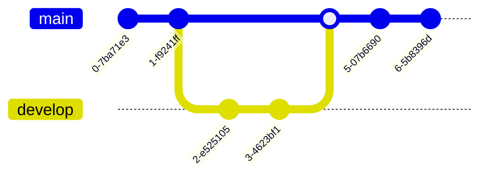

# Mermaid.js Quick Reference - GitHub Compatible

## 🎯 Critical Rule: GitHub Rendering

**ALL Mermaid diagrams MUST use this exact format:**

```markdown
```mermaid
[your diagram here]
```
```

**That's it. Nothing else works on GitHub.**

---

## ✅ The ONE Correct Format

```markdown

```

This renders on GitHub as:


---

## ❌ Common Mistakes That Break GitHub

### DON'T use HTML divs
```html
<!-- ❌ WRONG - GitHub won't render this -->
<div class="mermaid">
graph TD
    A --> B
</div>
```

### DON'T use wrong fence tags
```markdown
<!-- ❌ WRONG -->
```mermaidjs
graph TD
```

<!-- ❌ WRONG -->
```diagram
graph TD
```

<!-- ❌ WRONG -->
```
graph TD
```
```

### DON'T forget the language identifier
```markdown
<!-- ❌ WRONG - Missing 'mermaid' after backticks -->
```
graph TD
    A --> B
```
```

---

## 🧪 Testing Your Diagrams

**BEFORE committing, ALWAYS test at:**
https://mermaid.live/

1. Paste your diagram code
2. Check for syntax errors
3. Verify it renders correctly
4. Copy the working code to your markdown

---

## 📊 Diagram Types & Syntax

### 1. Flowchart / Graph

**Basic:**
```markdown

```

**With Decision:**
```markdown

```

**Directions:**
- `TD` or `TB` - Top to Bottom
- `BT` - Bottom to Top
- `LR` - Left to Right
- `RL` - Right to Left

**Node Shapes:**


**Arrow Types:**
- `-->` Solid arrow
- `-.->` Dotted arrow
- `==>` Thick arrow
- `--text-->` Arrow with text

---

### 2. Sequence Diagram

```markdown

```

**Arrow Types:**
- `->` Solid line without arrow
- `-->` Dotted line without arrow
- `->>` Solid line with arrow
- `-->>` Dotted line with arrow
- `-x` Solid line with X
- `--x` Dotted line with X

**Activations:**
```markdown

```

---

### 3. Class Diagram

```markdown

```

**Relationships:**
- `<|--` Inheritance
- `*--` Composition
- `o--` Aggregation
- `-->` Association
- `--` Link

**Visibility:**
- `+` Public
- `-` Private
- `#` Protected
- `~` Package

---

### 4. State Diagram

```markdown

```

---

### 5. Entity Relationship Diagram (ERD)

```markdown

```

**Relationship Types:**
- `||--||` One to one
- `||--o{` One to many
- `}o--o{` Many to many
- `||--|{` One to exactly one
- `|o--o|` Zero to one

---

### 6. Gantt Chart

```markdown

```

---

### 7. Pie Chart

```markdown

```

---

### 8. Git Graph

```markdown

```

---

## 🎨 Styling (Optional)

### Node Styles
```markdown

```

### Class Styles
```markdown

```

---

## 💡 Best Practices

### 1. Keep It Simple
```markdown
<!-- ✅ GOOD - Clear and readable -->

```

```markdown
<!-- ❌ TOO COMPLEX - Hard to read -->

```

### 2. Use Meaningful Labels
```markdown
<!-- ✅ GOOD -->

```

```markdown
<!-- ❌ BAD -->

```

### 3. Add Titles and Context
```markdown
```mermaid
---
title: User Authentication Flow
---
flowchart TD
    Start([User Visits Site]) --> Login[Login Page]
    Login --> Auth{Authenticate}
    Auth -->|Success| Dashboard[Dashboard]
    Auth -->|Fail| Error[Error Message]
```
```

### 4. Group Related Items
```markdown
```mermaid
flowchart TD
    subgraph Frontend
        UI[User Interface]
        State[State Management]
    end
    
    subgraph Backend
        API[API Server]
        DB[(Database)]
    end
    
    UI --> API
    API --> DB
```
```

---

## 🔍 Quick Troubleshooting

### Diagram Not Rendering?

1. **Check fence syntax:**
   - Must be exactly \`\`\`mermaid (three backticks + word "mermaid")

2. **Test on Mermaid Live:**
   - https://mermaid.live/
   - Copy your code there first

3. **Check for syntax errors:**
   - Missing arrows: `-->` not `->`
   - Unclosed brackets: `[Node]` not `[Node`
   - Typos in keywords: `flowchart` not `flwochart`

4. **Verify GitHub compatibility:**
   - View the raw markdown on GitHub
   - Check if fence is correct
   - Try pushing to a test repo

### Common Syntax Errors

```markdown
<!-- ❌ WRONG - Single arrow -->
```mermaid
graph TD
    A -> B
```

<!-- ✅ CORRECT - Double arrow -->
```mermaid
graph TD
    A --> B
```
```

```markdown
<!-- ❌ WRONG - Unclosed bracket -->
```mermaid
graph TD
    A[Node --> B[Node]
```

<!-- ✅ CORRECT - Properly closed -->
```mermaid
graph TD
    A[Node] --> B[Node]
```
```

---

## 📚 Complete Example: System Architecture

```markdown
```mermaid
flowchart TB
    subgraph Client
        Web[Web Browser]
        Mobile[Mobile App]
    end
    
    subgraph Frontend
        React[React App]
        Assets[Static Assets]
    end
    
    subgraph Backend
        API[API Gateway]
        Auth[Auth Service]
        User[User Service]
        Order[Order Service]
    end
    
    subgraph Data
        Redis[(Redis Cache)]
        Postgres[(PostgreSQL)]
        S3[S3 Storage]
    end
    
    Web --> React
    Mobile --> API
    React --> API
    
    API --> Auth
    API --> User
    API --> Order
    
    Auth --> Redis
    User --> Postgres
    Order --> Postgres
    Assets --> S3
    
    style Client fill:#e1f5ff
    style Frontend fill:#fff4e6
    style Backend fill:#f3e5f5
    style Data fill:#e8f5e9
```
```

This renders as:

```mermaid
flowchart TB
    subgraph Client
        Web[Web Browser]
        Mobile[Mobile App]
    end
    
    subgraph Frontend
        React[React App]
        Assets[Static Assets]
    end
    
    subgraph Backend
        API[API Gateway]
        Auth[Auth Service]
        User[User Service]
        Order[Order Service]
    end
    
    subgraph Data
        Redis[(Redis Cache)]
        Postgres[(PostgreSQL)]
        S3[S3 Storage]
    end
    
    Web --> React
    Mobile --> API
    React --> API
    
    API --> Auth
    API --> User
    API --> Order
    
    Auth --> Redis
    User --> Postgres
    Order --> Postgres
    Assets --> S3
```

---

## 🎯 Pre-Commit Checklist

Before committing any markdown with Mermaid:

- [ ] Using \`\`\`mermaid fence (three backticks + mermaid)
- [ ] Tested on https://mermaid.live/
- [ ] No syntax errors
- [ ] Labels are clear and descriptive
- [ ] Diagram is not overly complex
- [ ] Direction makes sense (TD, LR, etc.)
- [ ] Verified in GitHub preview (if possible)

---

## 🔗 Resources

- **Mermaid Live Editor**: https://mermaid.live/
- **Official Docs**: https://mermaid.js.org/
- **GitHub Markdown Guide**: https://docs.github.com/en/get-started/writing-on-github

---

## 🚀 Quick Templates

### Basic Flow
```markdown
```mermaid
flowchart TD
    Start([Start]) --> Process[Process]
    Process --> Decision{Decision?}
    Decision -->|Yes| ActionA[Action A]
    Decision -->|No| ActionB[Action B]
    ActionA --> End([End])
    ActionB --> End
```
```

### API Sequence
```markdown
```mermaid
sequenceDiagram
    Client->>+Server: Request
    Server->>+Database: Query
    Database-->>-Server: Results
    Server-->>-Client: Response
```
```

### Database ERD
```markdown
```mermaid
erDiagram
    USER ||--o{ ORDER : places
    ORDER ||--|{ ORDER_ITEM : contains
    PRODUCT ||--o{ ORDER_ITEM : includes
```
```

---

**Remember: Always use \`\`\`mermaid fence and test on mermaid.live before committing!**
